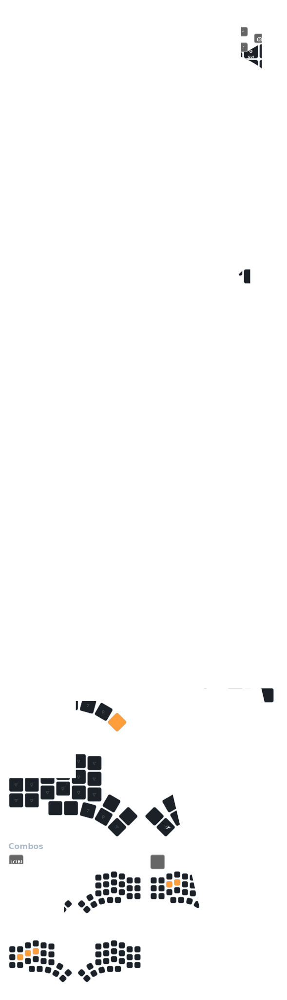

# ZMK Config

ZMK firmware configuration for Corne and Urchin keyboards, optimized for
English/French/Programming.

## Features

- QWERTY, [Colemak-DH](https://colemakmods.github.io/mod-dh/)
  and [Ergo-L](https://ergol.org) layouts
- French characters support with dead key and one accent layer per layout
- 5 columns with nice!nano v2 and nice!views
- Home row mods
- Mouse keys support
- Gaming Layer (shifted WASD position, free of homerow mods)
- Cursor/Scroll toggle with
  [Ploopy Nano Trackball](https://github.com/ploopyco/nano-trackball)
- Easy to read files, thanks to the
  [zmk-nodefree-config](https://github.com/urob/zmk-nodefree-config) helper

## Keymap

**Legend**

| Icon                    | Description                 |
|:-----------------------:|-----------------------------|
|         | Mouse left click            |
|       | Mouse middle click          |
|        | Mouse right click           |
|      | Toggle mouse scroll (trackball/scrollball) |
|             | Directional mouse scroll    |
|        | Move mouse pointer          |
|                    | Space                       |
|       | Non-Breaking Space          |
|                | Backspace                   |
|                   | Delete                      |
|                      | Tab                         |
|                    | Return / Enter              |
|              | Printscreen                 |
|                      | Cut                         |
|                     | Copy                        |
|                    | Paste                       |
|         | Play / Pause                |
|     | Previous track              |
|         | Next track                  |
|          | Volume up                   |
|        | Volume down                 |
|          | Clear Bluetooth profile     |
|       | Previous Bluetooth profile  |
|           | Next Bluetooth profile      |
|  | Toggle Bluetooth/USB output |

For more details, head to [corne.keymap](config/corne.keymap) and source files.

## Behaviors

The keymap uses a few behaviors in order to make everything work:

- [Combos](behaviors/combos.dtsi)
- [Hold-Tap (Home Row Mods)](behaviors/hold-tap.dtsi)
- [Macros](behaviors/macros.dtsi)
- [Mod-Morph](behaviors/mod-morph.dtsi)

## Layout
[Colemak-DH](https://colemakmods.github.io/mod-dh/) 

## References
- [Corne Keyboard](https://github.com/foostan/crkbd)

